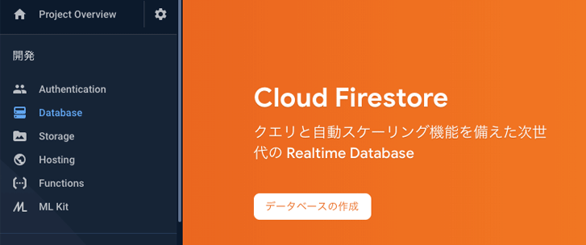
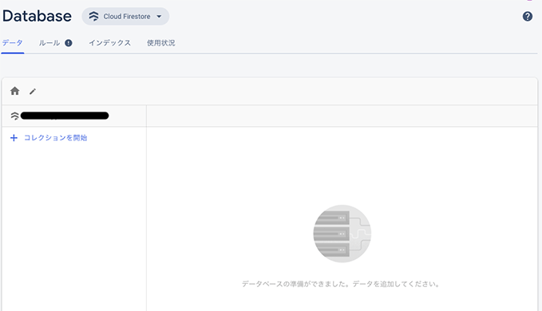
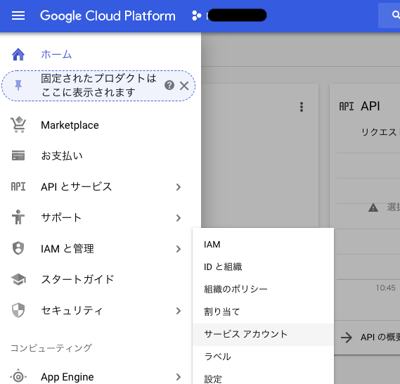
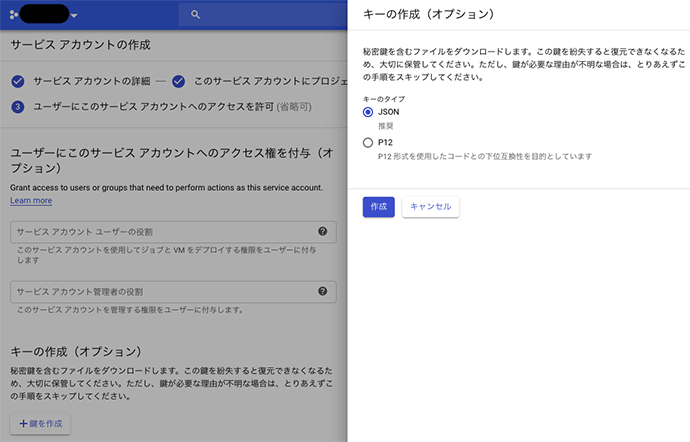

# prac-firebase

注意点：Firebaseにアクセスするためのアクセスキーを公開しないように気をつけるべし(今回はプライベートかつ練習なのでおけい)

[参考にしたいサイト](https://rightcode.co.jp/blog/information-technology/golang-introduction-firestore)

### FirebaseとFirestoreの違い
jsのSDKを組み込むだけで、簡単にリアルタイム通信・json storeが実現できるFirebase Realtime Database、それをさらに進化させて複雑なデータ検索
にも対応できるFirestore、フロントで生成・アップロードしたファイルを簡単に保存できるFirebase Storage、それぞれ無料で使い始めることが可能ながら、
とても可能性を秘めたサービスです。
現在Firebaseでは、データベースとしての機能がRealtime DatabaseとFirestoreの２種類提供されています。

### Firebaseを使うまでの流れ
データベースを作成


構築完了


今回はGCPではなく、ローカルで作業を行うので「各自のサーバで初期化する」

まずはIAMと管理→サービスアカウントを作成



データベースにアクセスするための鍵を作成(今回はJSON)
鍵は自動的にローカルにダウンロードされるのでディレクトリに配置する


あとは下記のコードで接続と初期化を行う

```cassandraql
package main

import (
	"context"
	"log"

	firebase "firebase.google.com/go"
	"google.golang.org/api/option"
)

func main() {
	// Use a service account
	ctx := context.Background()
	sa := option.WithCredentialsFile("path/my-project.json")
	app, err := firebase.NewApp(ctx, nil, sa)
	if err != nil {
		log.Fatalln(err)
	}

	client, err := app.Firestore(ctx)
	if err != nil {
		log.Fatalln(err)
	}
	defer client.Close()
}
```